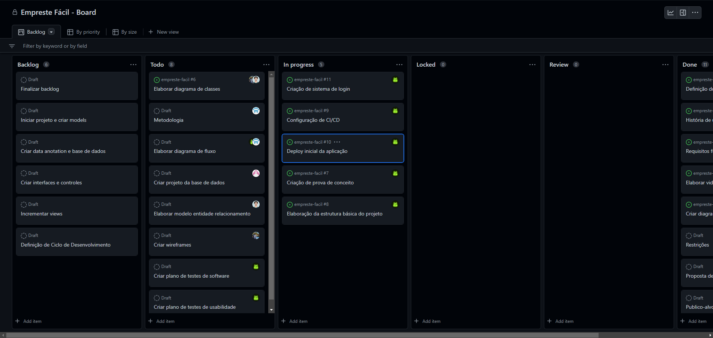

# Metodologia
A aplicação será desenvolvida com base no protocolo HTTP, utilizando a linguagem de marcação HTML5 com formatação em CSS. A programação da aplicação será feita em javascrip com a utilização da ferramenta Visual Studio Code. Todo o versionamento do projeto será feito via Git com repositório GitHub. Quanto ao método de gestão, será utilizada a metodologia ágil SCRUM.

<b>Relação de Ambientes de Trabalho</b> 

Os artefatos do projeto são elaborados a partir de diversas plataformas e a relação dos ambientes com seu respectivo propósito é apresentada conforme a tabela a seguir:

| Ambiente                           | Plataforma        | Link de Acesso                                                                      |
|------------------------------------|-------------------|-------------------------------------------------------------------------------------|
| Repositório de código fonte        | GitHub            | https://github.com/ICEI-PUC-Minas-PMV-ADS/empreste-facil                            |
| Documentos do projeto              | GitHub            | https://github.com/ICEI-PUC-Minas-PMV-ADS/empreste-facil/tree/main/docs             |
| Projeto de Interface e  Wireframes | Figma             | https://www.figma.com/file/Y0s8KcEAaPHQzBZ5M4VrN5/Empreste-F%C3%A1cil?node-id=0%3A1 |
| Gerenciamento do Projeto           | GitHub - Projects | https://github.com/orgs/ICEI-PUC-Minas-PMV-ADS/projects/72                          |

## Controle de Versão

- `main`: versão estável já testada do software;
- `unstable`: versão já testada do software, porém instável;
- `testing`: versão em testes do software;
- `dev`: versão de desenvolvimento do software.

A *branch* **main** será utilizada para versões que estão prontas para produção. Ela será replicada na *branch* **dev**, que conterá versões em desenvolvimento e ainda passíveis de teste. A *branch* **teste** será usada para a realização de testes nos código para preparaçao para produção. Caso problemas sejam identificados, as correções serão isoladas na *branch* **unstable** de modo a estabilizar a versão que entrará em produção.

- `documentation`: melhorias ou acréscimos à documentação;
- `bug`: uma funcionalidade encontra-se com problemas;
- `enhancement`: uma funcionalidade precisa ser melhorada;
- `feature`: uma nova funcionalidade precisa ser introduzida.

## Gerenciamento de Projeto
Conforme citado, a equipe utilizará a metodologia *scrum*, de modo que haverá esforços concentrados e incrementais divididos em *sprints* que durarão, como regra, 2 semanas.

* _**Scrum master**_: Aaron Duarte Dalla
* _**Product owner**_: Iago José Silva Ferreira
* _**Equipe de *desenvolvimento***_:
    * Gabriel Miranda Cangussu
    * Matheus Henique Rodrigues
    * Thiago Costa Prates
* _**Equipe de *design***_:
    * Tafarel Luis de Mello
    * Renan Costa Cunha

### Divisão de Papéis
A metodologia *scrum* foi conjugada com o método *kanban* de forma a tornar visual a distribuição de tarefas, o que está sendo feito por meio da ferramenta *projects* do *github*. As raias existentes são:
* *Backlog*: contém as tarefas identificadas e necessárias para a criação do produto;
* *To do*: contém as tarefas que serão incluídas na *sprint*;
* *In progress*: contém as tarefas que foram iniciadas e estão em desenvolvimento;
* *Test*: contém as tarefas que foram concluídas e serão checadas, de forma a se controlar a qualidade do desenvolvimento;
* *Done*: contém as tarefas que foram concluídas e testadas;
* *Locked*: nesta coluna são colocadas tarefas que foram paralisadas em razão de algum motivo impeditivo que precisa de solução.

### Processo
A figura abaixo ilustra a utilização do *kanboard*:

### Ferramentas
As ferramentas utilizadas no projeto estão abaixo enumeradas:

**Editores de Código:**
> - [Github](https://github.com/): Ferramenta utilizada tanto como editor de código quanto como ferramenta de organização, serve como local síncrono de armazenamento e edição do repositório do projeto.
> - [Visual Studio Code](https://code.visualstudio.com/): Ferramenta utilizada em conjunto com o Github para a confecção de códigos mais complexos.
>- [Visual Studio](https://visualstudio.microsoft.com/pt-br/): Ambiente de desenvolvimento integrado para desenvolvimento, compilação e distribuição de códigos em C# com o framework .NET.

**Ferramentas de Comunicação e Organização:**
> - [Microsoft Teams](https://www.microsoft.com/pt-br/microsoft-teams/group-chat-software): Ferramenta utilizada para realizar as reuniões de equipe, assim como as reuniões semanais em conjunto com a coordenadora do projeto.
> - [Microsoft Office](https://www.office.com/): Ferramenta utilizada em suas diversas funcionalidades. O Microsoft Word foi usado para a confecção da documentação do projeto, o Power Point foi a ferramenta escolhida para a apresentação da proposta de projeto. O próprio sistema Office serviu como local de compartilhamento de documentos.
> - [GitHub Projects](https://github.com/ICEI-PUC-Minas-PMV-ADS/crypto-conversor/projects?type=beta): Ferramenta utilizada para a organização e separação de tarefas no projeto.

**Ferramentas de Desenho de Tela (_wireframing_):**
> - [Canva](https://www.canva.com/): Ferramenta utilizada como um protótipo na realização do _design_ do projeto de interface.
> - [Figma](https://www.figma.com/): Ferramenta utilizada na versão final do projeto de interface.
> - [Draw.io](https://drawio-app.com/): Ferramenta utilizada na confecção dos _wireframes_.