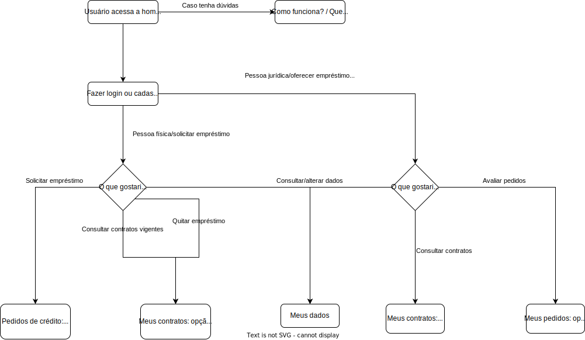

# Projeto de Interface

Visão geral da interação do usuário pelas telas do sistema e protótipo interativo das telas com as funcionalidades que fazem parte do sistema (wireframes).

Apresente as principais interfaces da plataforma. Discuta como ela foi elaborada de forma a atender os requisitos funcionais, não funcionais e histórias de usuário abordados nas <a href="2-Especificação do Projeto.md"> Documentação de Especificação</a>.

## Diagrama de Fluxo

### Pessoa Física (solicitar empréstimo)

Após o cadastro/login, terá acesso à sua página personalizada, de acordo com o que deseja:

* Deseja solicitar um empréstimo: Novo pedido, preencher valor do empréstimo e número de parcelas desejadas. Caso concorde com a simulação de parcelas, o pedido irá para o sistema, onde será avaliado pelas empresas/pela empresa

* Deseja consultar os contratos já vigentes: Caso alguma empresa aceite o pedido, ele aparecerá em contratos vigentes. Onde o usuário terá algumas opções:

            * Quitar o empréstimo
            * Renegociar o empréstimo

* Deseja consultar ou alterar seus dados pessoais: Meus dados

### Pessoa Jurídica (oferecer empréstimo) - Em análise

Após o cadastro/login terá acesso à sua página personalizada, de acordo com o que deseja:

* Deseja oferecer um empréstimo: Pedidos de crédito. Terá a opção de aceitar ou recusar

* Deseja consultar os contratos já vigentes: Meus contratos. Terá a opção de confirmar o pagamento ou denunciar atraso

* Deseja consultar ou alterar os dados da empresa: Meus dados

## Wireframes

Ilustração semelhante do layout de elementos fundamentais na interface.

