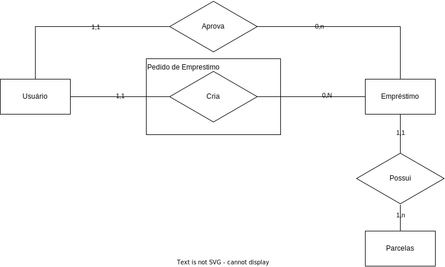

# Arquitetura da Solução

Pré-requisitos: <a href="3-Projeto de Interface.md"> Projeto de Interface</a>

Definição de como o software é estruturado em termos dos componentes que fazem parte da solução e do ambiente de hospedagem da aplicação.

## Diagrama de Classes

Abaixo é apresentado o diagrama de classes do projeto:

## Modelo ER (Projeto Conceitual)

O Modelo ER representa através de um diagrama como as entidades (coisas, objetos) se relacionam entre si na aplicação interativa.

## Projeto da Base de Dados

O projeto da base de dados corresponde à representação das entidades e relacionamentos identificadas no Modelo ER, no formato de tabelas, com colunas e chaves primárias/estrangeiras necessárias para representar corretamente as restrições de integridade.

## Tecnologias Utilizadas

Editores de Código:
- Github: Ferramenta como ferramenta de organização, serve como local síncrono de armazenamento e controle do repositório do projeto.
- Github Actions: Ferramenta utilizada para a integração contínua e deploy do projeto,
- Visual Studio Code: Ferramenta para a confecção de códigos mais complexos.
- Visual Studio 2022: Ferramenta utilizada como ambiente de desenvolvimento integrado.

Ferramentas de Comunicação e Organização:
- Microsoft Teams: Ferramenta utilizada para realizar as reuniões de equipe, assim como as reuniões semanais em conjunto com a coordenadora do projeto.
- GitHub Projects: Ferramenta utilizada para a organização e separação de tarefas no projeto.

Ferramentas de Desenho de Tela (wireframing):
- Canva: Ferramenta utilizada como um protótipo na realização do design do projeto de interface.
- Figma: Ferramenta utilizada na versão final do projeto de interface.
- Draw.io: Ferramenta utilizada na confecção dos wireframes.

Desenvolvimento
- C# e .NET com o ASP.net MVC: Desenvolvimento do core da aplicação, arquitetura, build, compilação da aplicação.
- Entity Framework: Framework utilizado para a conexão e controle do banco de dados.
- SQL Server: Banco de dados relacional utilizado como o armazenamento central de dados da aplicação.
- Razor Pages: Framework utilizado para a confecção de páginas da web interativas.

## Deploy

Para a hospedagem do projeto, serão utilizados serviços em núvem providos pela Amazon
- Amazon Relational Database Service (RDS) - Provisionamento de banco de dados
- Amazon Elastic Compute Cloud (EC2) - Hospedagem e distribuição da aplicação 
- Amazon Route 53 - Gerenciamento de DNS
